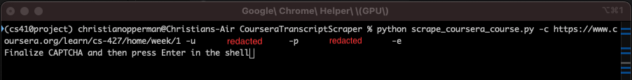
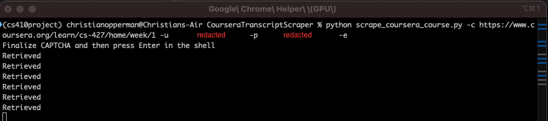
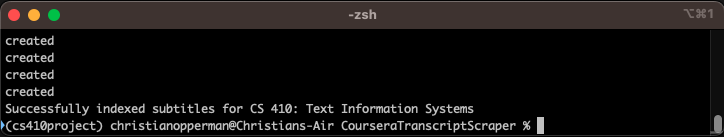

# CS410 CourseProject (Team CAHJ) - Coursera Search with ChatGPT Querier

## Project Overview
### <u>Problem Statement</u>
For our project, we wanted to solve two problems: 1) the difficulty of searching for information in Coursera videos, and 2) the difficulty of synthesizing class information into a digestable unit of content. We solve these problems with two products: a Chrome Extension to search Coursera videos, and a ChatGPT Integration is queryable, leveraging LLMs and the emerging technology of AI in order to provide a study tool and information synthesizer for UIUC students to use.

Essentialy, our project provides a way for UIUC students using the Coursera platform for their degree to find concepts in their video lectures without having to tediously scroll through each video in a course and use their browser's search function to find a term. Often, a class can have many weeks of content, and each week can have many videos. If you know there's a video that you want to re-watch in order to study a concept, but can't remember in which video (or even which week!) that concept can be found, this project will hopefully make your life a lot easier! In addition, the ChatGPT module is a queryable script trained on the Coursera video transcripts that power the Chrome Extension, allowing students to query a specialized verison of ChatGPT about their course content.

### <u>Project Workflow</u>
Overall, the project is quite simple. It consists of three parts:
1. Coursera Course Transcript Scraper
2. ChatGPT Integration
3. Coursera Search Chrome Extension

The Coursera Course Transcript Scraper is necessary because dynamically scrapping the course video transcripts simply takes too long; it would make the search function untenably tedious. Similarly, without scraped data, the ChatGPT integration would not be able to be trained correctly. The Transcript Scraper utilized Python, particularly the `beautifulsoup` and `selenium` modules to scrape video transcripts from a course provided by the user, and then indexes those transcripts to `ElasticSearch`. This indexed data is what powers the Chrome Extension and ChatGPT Integration.

The ChatGPT Integration, also written in Python, uses the `langchain` module to split and store the course transcript data into chunks, which are then fed into the GPT-API via the `openai` module as context with the user's query. This allows the LLM to provide an answer that is informed by the Coursera course content.

The Chrome Extension UI is written in HTML and CSS, while the functionality uses JavaScript.


### <u>Project Requirements</u>
This project is fairly straightforward with regards to requirements on the user's machine, but there are a few baselines that are required to be hit:
- The project requires Google Chrome to work.
- The project requires ChromeDriver, maintained by Chronium, to be installed in the root directory of the project in order to enable scraping (see Step 2 under Installation Instructions, below).
- The project requires a working installation of Python to scrape new course content. The file `requirements.txt` includes the packages necessary for the script to run. If you plan to scrape new course content into the project ElasticSearch index, please ensure your Python environment satisfies these requirements.
- As the extension is not deployed to the Google Chrome Web Store, it requires a local copy of the codebase on the user's computer (see Step 1 under Installation Instructions, below).
- In order for the ChatGPT functionality to work, you will need an OpenAI API Key ([see here](https://platform.openai.com/api-keys)) and add that key to your environment variables as a new variable called `OPENAI_API_KEY`. Instructions for how to add environment variables can be found here: [Mac](https://phoenixnap.com/kb/set-environment-variable-mac) | [Windows](https://www.howtogeek.com/787217/how-to-edit-environment-variables-on-windows-10-or-11/) | [Linux](https://linuxize.com/post/how-to-set-and-list-environment-variables-in-linux/)


## Installation Instructions
Installing the extension is quite simple; all you need to do is download the code from GitHub and then activate the extension in Chrome.
A step-by-step guide for the above is below.:

1. Pull the code from GitHub to `desiredDirectory` using your shell:
 ```
 cd desiredDirectory
 git clone https://github.com/christianopperman/CS410_Fall2023_CourseProject_TeamCAHJ.git
 ```
2. Install the appropriate ChromeDriver for your computer's enviornment from [this link](https://googlechromelabs.github.io/chrome-for-testing/#stable), unzip it, and move the `Google Chrome for Testing` application to the `CS410__Fall2023_CourseProject_TeamCAHJ` directory created in Step 1, above.
3. Open Google Chrome.
4. Go to the Extensions page on Google Chrome by following [this link](chrome://extensions).
5. Activate Developer Mode by toggling the switch in the upper right corner labeled `Developer mode`. <br>


6. Load the extension from the codebase pulled to your computer in Step 1 by clicking the `Load unpacked` button in the top left corner: <br>


7. Select the `desiredDirectory/CS410_Fall2023_CourseProject_TeamCAHJ/ChromeExtension` directory in the popup and click `Select` <br>


8. The extension should now be available to you in your Google Chrome Extensions list.

## Usage Instructions

### <u>Chrome Extension</u>

Under construction

### <u>Coursera Transcript Scraper</u>
As mentioned in [Requirements](#requirements) above, in order to scrape your own Coursera course transcripts into the extension, you will need a working version of Python that satisfies the required packages outlined in the `CourseraTranscriptScraper\requirements.txt` file.
Once you have that, scraping a new course into ElasticSearch is very easy:
1. Navigate to `desiredDirectory/CS410_Fall2023_CourseProject_TeamCAHJ/CourseraTranscriptScraper` in your shell
2. Call the course scraper script with, with the following command line arguments:
```
python scrape_coursera_course.py -c "course_url" -u "coursera_username" -p "coursera_password" [-e]
```
* Required Arguments
    * -c : The link to the landing page of the Coursera course you'd like to scrape
    * -u : The username to your Coursera account which has access to the course you'd like to scrape
    * -p : The password to your Coursera account which has access to the course you'd like to scrape

* Optional Arguments:
    * -e : A boolean flag. If included, the script will automatically push the scraped course transcriptions to ElasticSearch after saving them to disk. If not included, the transcriptions will be saved to disk but not pushed to ElasticSearch.

3. Once you run the above command, a window will pop up and automatically log you into Coursera. It is likely that you will be required to complete a CAPTCHA.
4. Once you complete the CAPTCHA, return to your shell and press Enter, as prompted.



5. The script will begin scraping, as evidenced by the pop-up window navigating between video pages in the course and the `Retrieved` messages in the shell window.



6. The script will write any scraped transcriptions to the filepath `subtitles_cs###.json`, where `###` is the three digit course code of the class you are scraping.
7. If the `-e` flag was passed to the script, the script will automatically push the scraped course's transcriptions to ElasticSearch.
8. Once the script is finished, you will see a success message, and the web driver window will automatically exit.



#### <u>Note</u>
Please be careful not to scrape too many courses at once. Coursera may block you if you issue too many requests to it in too short a time frame. As such, we recommend that you only scrape one course at a time.

### <u>ChatGPT Integration</u>
Under construction